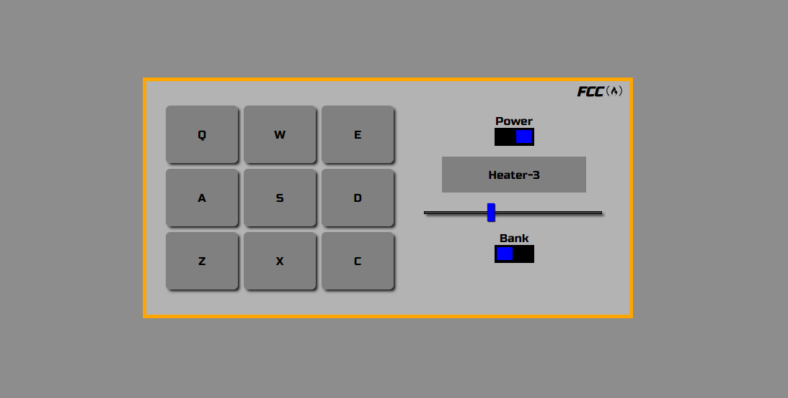

# Drum Machine

[live demo](https://gusV15.github.io/drum-machine/)

## Build using:

- Embedded React
- Hooks
  - useState
  - useEffect
  - useContext
- CSS in JS (styled-components)
- Fontawesome icons

## Required:

- Node.js

## How to run the project:

- `npm install` to install dependencies
- In the project directory, you can run: `npm start`
    Runs the app in the development mode.
- Open `http://localhost:3000` to view it in the browser.

## License

- MIT